# Lorentzian Peak Finder (now with MaChInE lEaRnInG!)

## Installing

To get things to work, you probably want to have the peak_finder directory in whatever directory you're running terminal or other python scripts or whathaveyou from. If this doesn't work for some reason, you can try using `from __future__ import absolute_import` before importing all the `peak_finder` stuff. If that doesn't work, let me know and I'll see if I screwed something up. You can also add `peak_finder` to PATH if you want to be able to call it from anywhere. That's technically the "preferred" way to run it.

## Extremely Quick Start Guide for Peak Finding

In an extreme rush? Lucky for you, there's an already set up configuration for you to work with. I promise you it will be better to manually go through and kajiggle parameters. But, if you just want to get a quick taste of stuff then you can use the following script:

```python
from peak_finder import automatic as auto
from peak_finder import utilities as util

# You'll have to pick which tdms file you look at tho.
tdms_file = util.import_file()
f = tdms_file.f
r = tdms_file.r

parameters = auto.quick_analyze(f, r)
print(parameters)
```

Or if you don't want any machine learning, but just want to use the selection tool while also seeing the x and y data, there's a super easy way to run that as well.

```python
from peak_finder.live_fitting import live_selection

parameters = live_selection(tdms_file)
```

Now that that's out of the way, let's go into how you _actually_ do stuff.

## Quick Start Guide for Peak Finding

To do the data analysis, there's not actually that much that you need to be aware of. For 99% of the stuff that actually involves data analysis, the functions listed here can just be used as black boxes that hopefully magically produce what they promise they do. I've also detailed the data types that they take and receive to hopefully prevent causing unnecesary headaches.

### Object Types

There's really only three object types that actually get used by the analysis tools. I've outlined them all here.

#### Data Array

This is just a normal 1D array of data points like you're used to. There's nothing really to say about it, but it's included here for completeness.

#### Region Array

This is a 2 by n array of regions where Lorentzians are supposed to be. Within each row the 0 index item is the start of the region (minimum frequency) and the 1 index is the end of the region (maximum frequency).

#### Parameter Array

This is a 4 by n array with the parameters for a bunch of Lorentzians. Each row is a different Lorentzian and is sorted like so:

`[ amplitude  center frequency  full width at half maximum  phase ]`

Note that the definition of Lorentzians I am using is the following.


Where the individual terms are as below.


### Useful Functions and Classes

#### Importing Models

To use the built in machine learning models just import them in the following way.

```python
tight_model = models.tight_lorentzian()
wide_model = models.wide_lorentzian()
```

You can also use `model = models.import_model()` to open a file dialog and import a model not included in peak_finder. In general, the wide model misses less Lorentzians. But, it tends to pick up a much wider area around the Lorentzians. The tight model doesn't catch the surrounding area, but it misses slightly more Lorentzians on average. In practice, you probably just need to try both and see what works best for the data you have.

#### Importing Files

You can of course import a tdms file however you please. But, there's an included way to do it with a file dialog if you want. From there it's easy to snag the frequency data, x, y, or r=sqrt(xz^2 + y^2).

```python
tdms_file = util.import_tdms_file()
f = tdms_file.f
x = tdms_file.x
y = tdms_file.y
r = tdms_file.r
```

You can also save and load any object you end up creating (such as a 3D parameter array) like so:

```python
# Saving without a file path opens a dialog window.
file_path_of_save = util.save(some_object)

# Can also save with a file path to not get a dialog window.
file_path_of_save = util.save(some_object, some_path)

# To load the object without a dialog window, pass in the file path.
that_same_object = util.load(file_path_of_save)

# Can also load the object without a file path. This opens a dialog window.
that_same_object = util.load()
```

The file created this way is not necesarily readible by other programs. So, the final exported data should probably not be handled in this way.

#### Using Models

Any time you want to use the models, you're either going to use the `slide_scale` or the `split_peaks` function. Both of these get region arrays from data. But, `slide_scale` is for getting initial region arrays and `split_peaks` is to separate peaks apart that are caught in the same region. This is probably easiest to show by example.

```python
from peak_finder import models
from peak_finder import utilities as util
from peak_finder.sliding_window import slide_scale
from peak_finder.sliding_window import split_peaks

wide_model = models.wide_lorentzian()
tdms_file = util.import_file()
r = tdms_file.r

regions = slide_scale(wide_model, r)
```

This gives a 2D regions array after looking over the data with the wide Lorentzian model. Note that the model doesn't need the frequency data to do its thing. This is because all the data gets sliced up and normalized anyways. If the collected data isn't at even frequency steps, then this would cause a problem. I actually included a tool to deal with this, but I don't want to drag this tutorial out any more than I have to. Anyways, you could technically stop messing with the models here. But, you'll probably have to play with a bunch of optional parameters to get the peaks snagged to your satisfaction. So, let's go over those super fast. A full version of `slide_scale`'s inputs (or at least the one that are supposed to be tweaked) is shown below.

```python
slide_scale(
    model, 
    v,  
    min_zoom=5, 
    max_zoom=8, 
    overlap=1/4, 
    confidence_tolerance=0.95, 
    merge_tolerance=None, 
    compress=False, 
    single_zoom=False,
    progress=True,
    simplify=False
)
```

Here's what they are:
 - `model`: The model you wan't to analyze with. This is usually wither the tight or wide model.
 - `v`: The data you want to look at (`x`, `y`, or `r`).
 - `min_zoom`: The most zoomed out your data is when it's shown to the model. Too low and the model reads the background.
 - `max_zoom`: The most zoomed in your data is when it's shown to the model. Too high and the model reads the noise.
 - `overlap`: How much the windows show to the model overlap with each other.
 - `confidence_tolerance`: How confident the model needs to be that a given window has a Lorentzian. I've found that when the model is right, it's very right. So, it's good to leave this high. But, it's worth setting it to 0 if you seem to be missing stuff. And then maybe play with putting it somewhere inbetween as needed. If it's set to 1 then no peaks will be detected.
 - `merge_tolerance`: The fraction of a window that needs to overlap with another window in order for them to be combined into one region. If left as `None` then this will automatically be set based on the `overlap`.
 - `compress`: If set to `False` then windows don't combine at all.
 - `single_zoom`: If set to `True` then the model only looks at the `min_zoom`. This is useful for quickly seeing what Lorentzians are at what zoom level.
 - `progress`: Determines whether or not a progress bar is shown while running.
 - `simplify`: Uses a script to simplify and compress overlapping regions. Generally it's best to leave this as `False` until you run the final round with the model. That is, if you split peaks after this then this should stay as `False` but be set to `True` when you split them there peaks.

That's everything for `slide_scale`. Luckily, `split_peaks` is almost identical, but has somewhat less parameters to play with. Keep in mind that you might not actually need to use `split_peaks` on many data sets. This is especially true if you use tight model to start with.

```python
split_peaks(
    model,
    f,
    v,
    regions,
    min_zoom=2,
    max_zoom=7,
    min_data_points=10,
    confidence_tolerance=0.0,
    single_zoom=False
)
```

As you can see, `split_peaks` also needs to have frequency data and regions to split apart passed into it. The only new parameter is `min_data_points` which is used to keep it from looking at any regions that are so small that it could only be measuring noise. I should probably add this feature to `slide_scale` as well... But...

#### Data Cleaning

After you're done applying a bunch of models and tweaking the results to your heart's content, it's time to actually extract meaningful parameters from regions. This is actually pretty easy to do. Just run the `parameters_from_regions` function.

```python
from peak_finder.fit_lorentz import parameters_from_regions

parameters = parameters_from_regions(f, r, regions)
```

The optional parameters include `max_n` which sets the maximum number of Lorentzians which could be fitted to in a region. Setting this high could increase the runtime substantially. Also included is `catch_degeneracies` which defaults to `True` and determines whether or not to remove duplicate Lorentzians. This sometimes happens if the same region is listed several times. Leaving this on substantially increases the runtime, but is almost always a good idea just in case. You can also do this afterwards with the `remove_degeneracies` function. 

Finally, there's `noise_filter` which removes any Lorentzians with amplitudes less than the amount specified. This defaults to 0, but it's a good idea to set it. Luckily, I've included an easy way to estimate the noise level.

```python
from peak_finder.sliding_window import extract_noise

noise_level = 3 * extract_noise(v)
parameters = parameters_from_regions(f, r, regions, noise_filter=noise_level)
```

#### Live Parameter Editing

At this point, you should have a decent set of parameters without having to manually select Lorentzians at all. But maybe the models made some mistakes. Or maybe you just like grabbing your peaks old school and doing it all by eye. Either way, there's a handy dandy tool to help with that.

```python
from peak_finder.live_fitting import Live_Instance

# By default a Live_Instance is set up only with data and needs to have Lorentzians imported after using a model.
live = Live_Instance(f, r)
live.import_lorentzians(parameters)

# You can then turn on the interface to edit parameters live.
live.activate()

# When you're happy with the Lorentzians shown, you can just extract the parameters from the live instance.
live.get_all_params()
```

The `Live_Instance` class keeps track of what the current parameters are as well as the data to work with. The code above shows what you need to do to use and extract parameters from it. To look at the x and y data while working with it, just run `live.import_all_data(x, y)` and then `live.activate()`. The live interface is shown below. Not that you should click the "Reset Axes" button if the home button isn't working. There's a slightly sketchy hack going on to make the interface reload properly that causes the home to reset every time new things are plotted.


The interface should be pretty intuitive. But, I'll go over it anyways. The higher curve is the actual data and the lower one is just the fit. I've called the fit the "projection" in the live interface. You can move it up or down by clicking "Raise Projection" and "Lower Projection." You can also look at the separate x and y components after running `live.import_all_data(x, y)`. Just click "Show/Hide Components." The x component is yellow and the y component is green. These can be moved up and down like the projection.


To remove Lorentzians just click the cleverly named "Remove Lorentzians" button. Then you can click and drag an area around the Lorentzians you want to get rid of. Press enter to remove them or escape to un-select an area.


And to add Lorentzians just click "Add Lorentzians" and select an area to add. Unlike "Remove Lorentzians" only one Lorentzian is added at a time. This is because doing otherwise would be a world ending disaster.


#### A Complete Example

A complete workflow example is shown in the [included notebook](./train_and_test.ipynb). This is a good way to visualize everything, but everything also works via command line or however else you want to use the package. The example is run on `CeCoIn5/AG2832-II/2_cooldown/20190510_164351_1.875K_1.875K.tdms`.

### Other Potentially Helpful Things

WiP. Feel free to check the `utilities` docstrings in the meantime.

## Extremely Quick Start Guide for Peak Tracking

The quickest, easiest, and _usually_ the most effective way to do peak tracking is to do a `color_selection`.

```python
from peak_finder.live_fitting import color_selection
from peak_finder.fit_lorentz import parameters_from_selections
from peak_finder import utilities as util

data_files = util.import_tdms_files()
selections = color_selection(data_files)
tracked_peaks = parameters_from_selections(selections)
```

The `import_tdms_files()` call creates a list of `Data_File` objects from the chosen directory. These then get passed into `color_selection` which opens the following window.

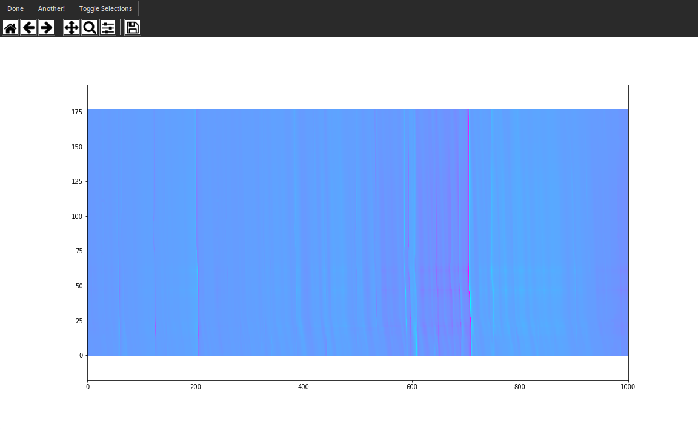

This is a color plot of imported files, but likely drastically scaled down to load faster and be easier to manipulate. You can change the resolution or the color map of the plot by passing `x_res`, `y_res`, and `cmap` into `color_selection`. Default values are `x_res=1000`, `y_res=100` and `cmap="cool"`. From here you can just zoom in around the path of some peak and select around to highlight it. There's no button to activate the selector, it's on by default.

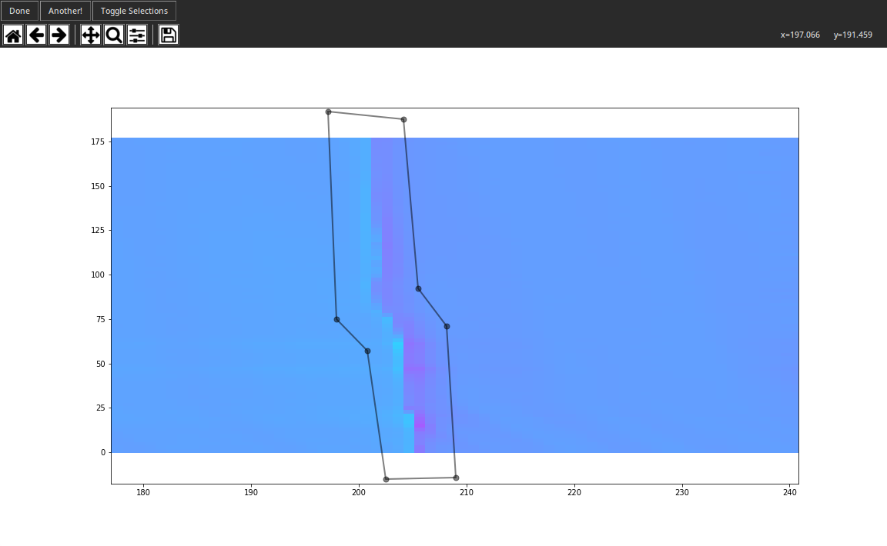

If you're not 100% satisfied with your selection, you can press the control key to move around old vertices or the escape key to start over. When you're satisfied with your selection, either hit return/enter or click on "Another!" to start selecting a new peak. 

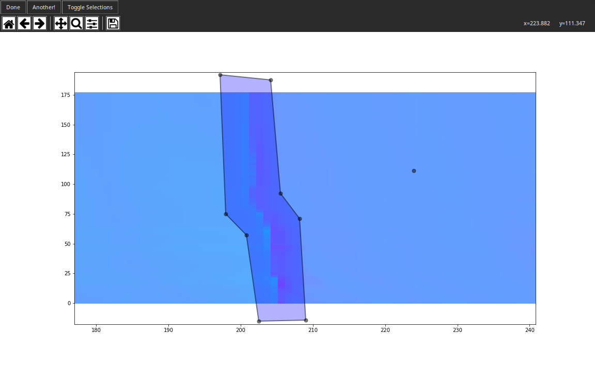

This turns the previously selected peak blue and saves it so it can no longer be interacted with. If you're trying to select around peaks that overlap and get frustrated with seeing all the selections, you can hit the spacebar or click "Toggle Selections" to turn on/off the display of all the previous selections made. You can select as many paths as you like.

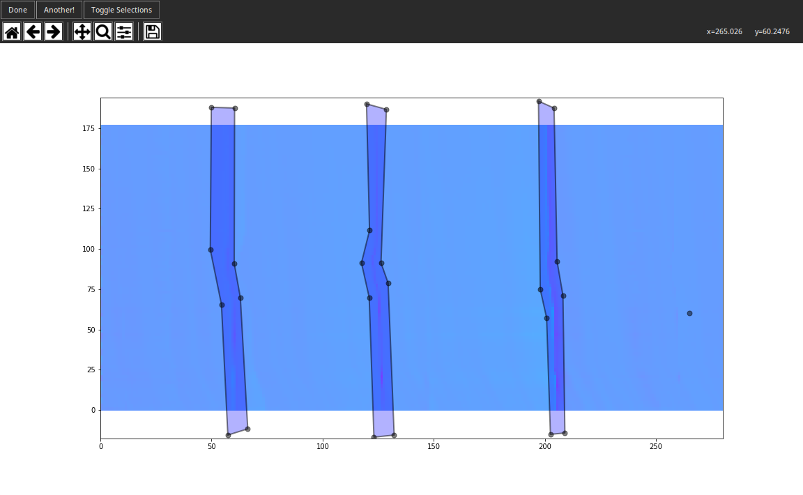

When you're satisfied with your work, click "Done." You don't have to worry about the output, but it's a dictionary of regions corresponding to all of the different temperatures and peaks selected. You can just pass this into `parameters_from_selections`, sit back, and wait for the program to fit to your peaks. Depending on how many peaks you select and how many original tdms files there were, this can take quite a while. So, grab a book or stress about over getting something else done in the meantime while you watch the loading window slowly tick by.


When the fittting is done, the output is a 3D array of parameters. The columns and rows are just like the 2D parameter arrays. But, each "table" is a different temperature step. So, if we want to plot the center frequency of the Lorentzians from the example above, we could just use the code below.

```python
x = util.get_temperatures(data_files)
for i in range(0, len(tracked_peaks[0])):
    y = tracked_peaks[...,i,1]
    plt.plot(x, y)
```

And this spits out the following plot.

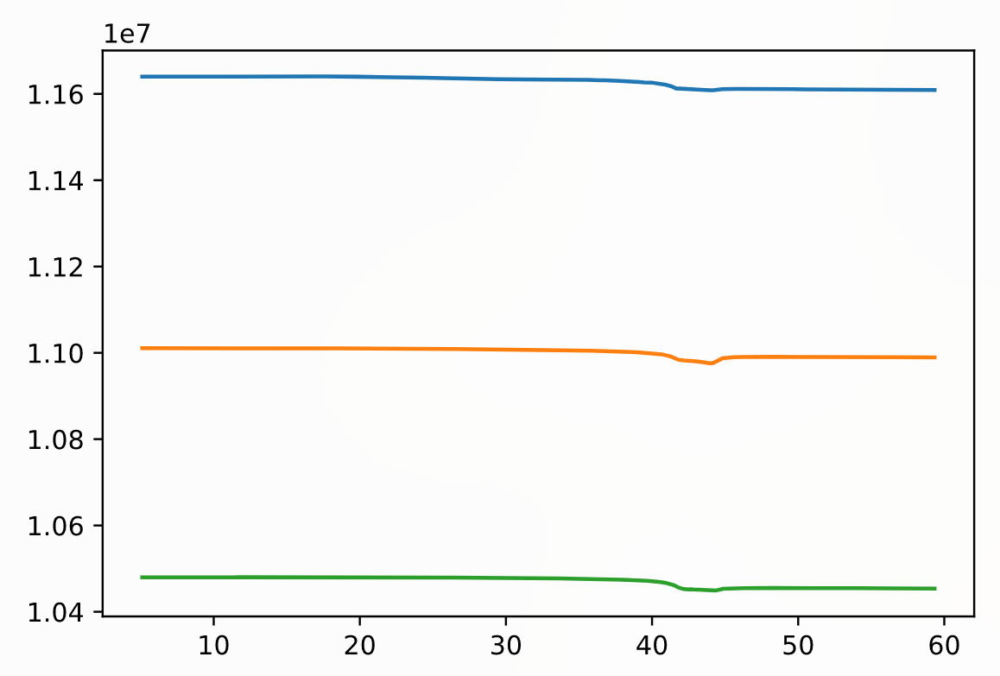

And since the parameters are preserved in full, we can also see their amplitudes, full widths at half maximum, or phases just as easily.

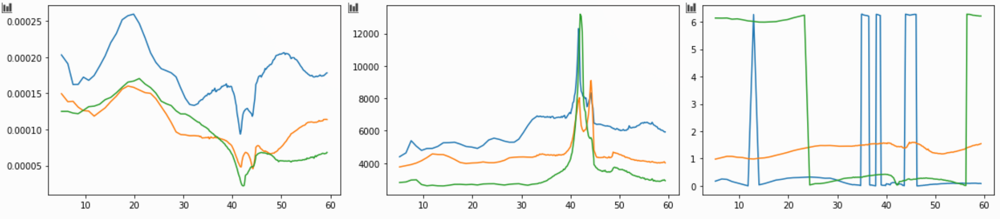

The phases above may _look_ like they jump around. But, that's just because they're shown modulo 2 pi.

### Other Assorted Features and Keyboard Shortcuts

In the day since the Extremely Quick Guide was written, several other useful features have been added.

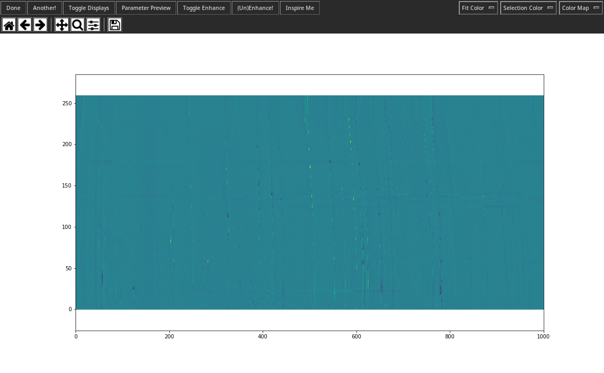

You can click "Toggle Enhance!" or press "e" to turn on/off Enhance! mode. This enables you to click and drag a rectangular region that gets re-rendered at the maximum resolution. 

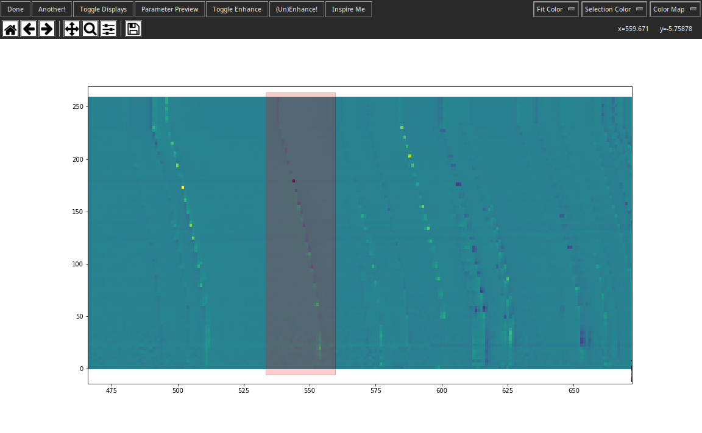

It also re-normalizes the color map over this region to reveal things that might have been too small to reveal in genera.

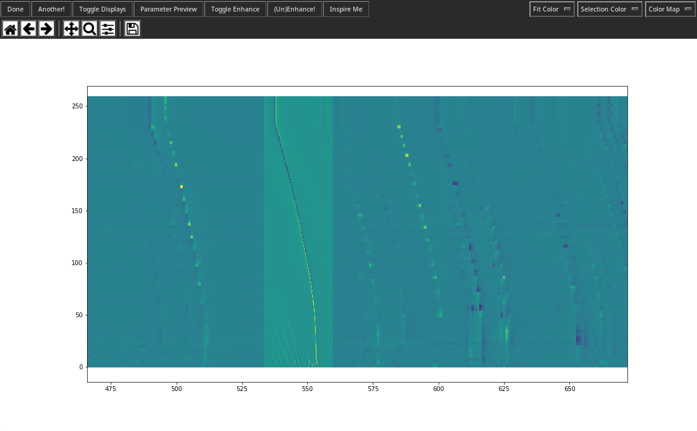

Enhance! mode stays active until you toggle it off. So you can trace out many small regions in one go. If you enhance completely over a region that has already been enhanced then the original region is un-rendered to keep things snappy.

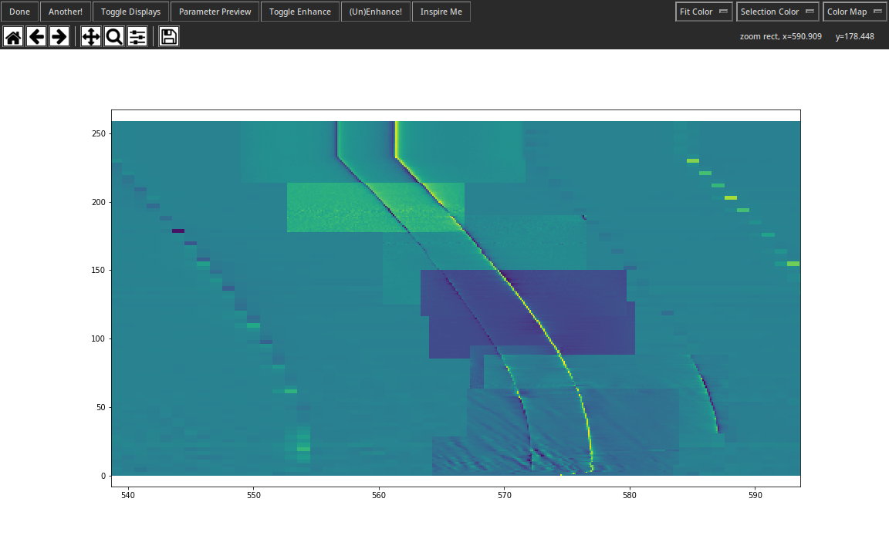

If you enhance so much that things start feeling getting too slow, you can click "(Un)Enhance!" or press "x" to un-render all the enhanced areas. But be warned, they are forgotten. You'll have to manually re-enhance them.

You can also fit over a 2D cross section of the color map by clicking "Preview Parameters" or pressing "p." Clicking "Inspire Me!" also does this, but it uses machine learning to try and predict where the Lorentzians are before opening the preview.

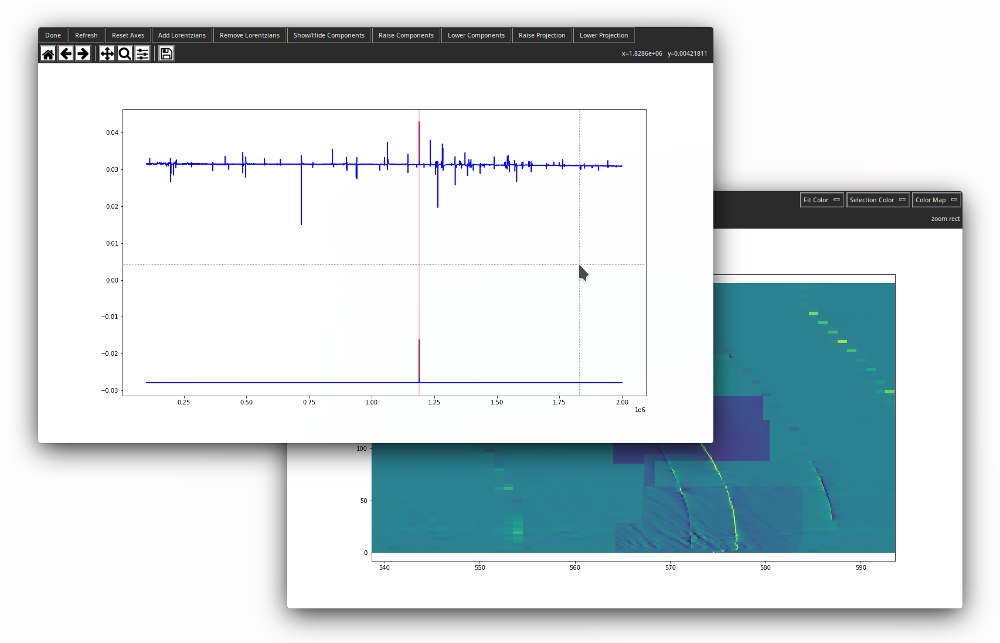

Finally, you can pass some fitted parameters _back into color selection_ to see how the fits look over the color plot. For example:

`selections = color_selection(data_files, parameters=tracked_peaks)`

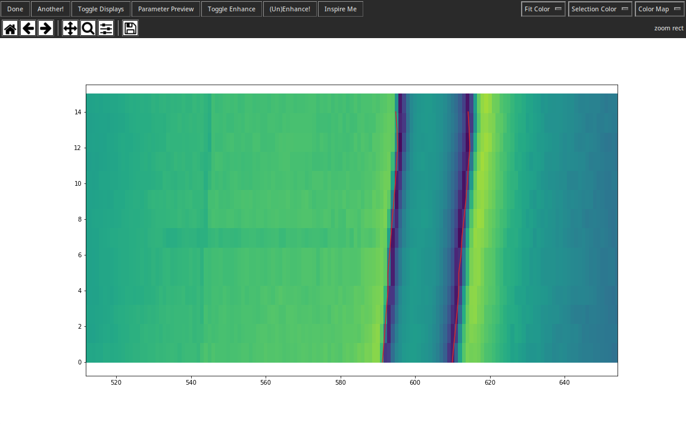

The parameters are included in the outputted selections. So, if you then fit over any new selections the output is a combined 3D array with both the old and new parameters.

### All Keyboard Shortcuts

| Mode | Shortcut | Action |
| :--- | :------- | :----- |
| Any | "e" | Toggle Enhance! mode. |
| Any | "x" | Turn off enhancements. |
| Any | "space" | Toggle display features. |
| Any | "p" | Open parameter preview. |
| Any | "i" | Activate "Inspire Me!" |
| Selection | "enter" | Save current selection. |
| Selection | "escape" | Restart current selection. |
| Selection | "control" | Edit vertices in current selection. |
| Enhance! | "shift" | Draw square area. |
| Enhance! | "escape" | Restart drawing enhanced area. |
| Enhance! | "control" | Draw enhanced area from center point. |

## Quick Start Guide for Peak Tracking

WiP. Will actually finish shortly!

## Quick Start Guide for Model Training

WiP. Will probably fill in some day maybe.
